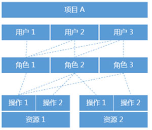
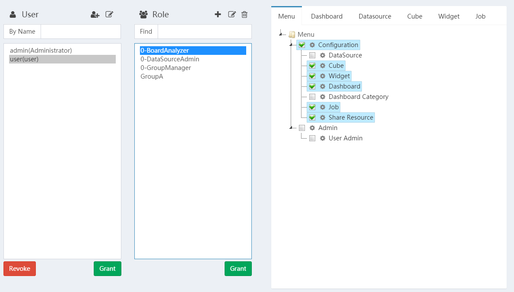

# User Administration

`RBAC` is short for Role Based Access Control. It consists of three parts: `User`, `Role`, `Operation/Resource`. Access list, also known as resource list, is assigned to the role group, grant Users one or more Roles to allow users to get resource access rights of their group.

The user management interface that corresponds to the CBoard is also divided into three pieces

    <h4><i class="fa fa-user" aria-hidden="true"></i> User：</h4>
    <ul>
        <li>user list</li>
        <li>add, edit user</li>
        <li>search user: default by username (including the login name).</li>
        <li>click the <kbd>name</kbd> button in front of the search box to search by user group.</li>
        <li>Hold down Ctrl and click the left mouse button to select multiple users or roles</li>
        <li>the buttons below the user checkbox are:</li>
            <ul>
              <li><b>Grant</b>: Select users and roles, grant roles to users. Each grant will override user`s role, When do this, hold down Ctrl and click on the left mouse button to add or remove the selected role.</li>
              <li><b>Revoke</b>: Select the user and role, remove the user from the role </li>
            </ul>
        <li>resources cannot be granted to users</li>
        <li>When a user is selected, the user's corresponding role will be changed.</li>
    <ul>

    <h4><i class="fa fa-users" aria-hidden="true"></i> Role：</h4>
    <ul>
      <li>click <kbd>+</kbd> to add role</li>
      <li>The role manager is used to manage the roles</li>
      <li>The role manager can only see the roles they created</li>
    <ul>

    <h4>Resource：</h4>
    <ul>
       <li>Menu: The first level menu is controlled separately from the second level menu, and there is no cascade</li>
       <li>Dashboard/Datasource/Dataset/Chart: Because the folder is a virtual path, it can be cascaded, but even if the folder is selected, after adding new resources to that folder, it's need to manually add the authorization.</li>
       <li>Administrators can only add resources they create to the group</li>
    <ul>

