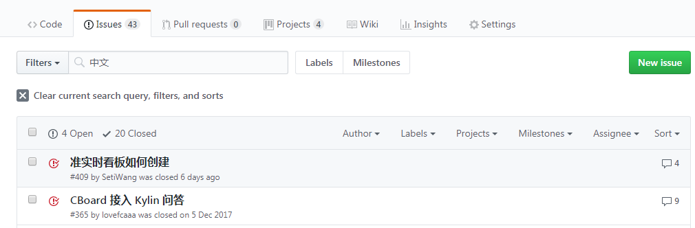
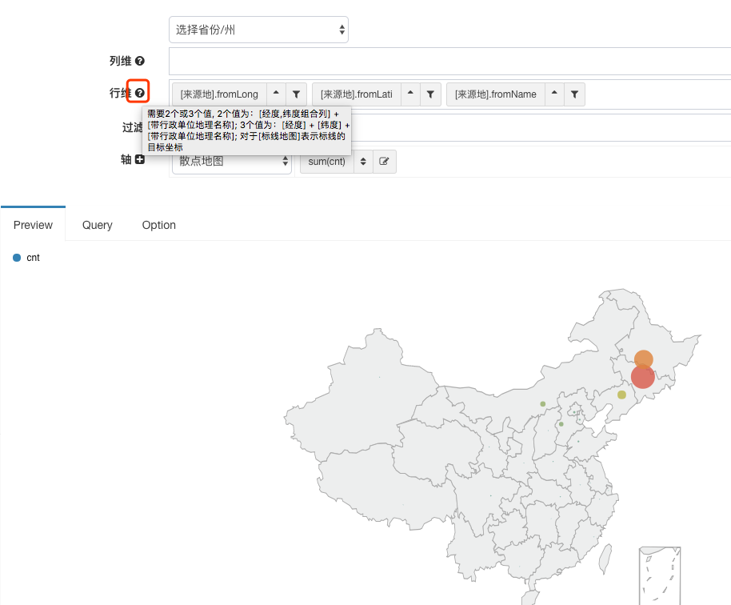
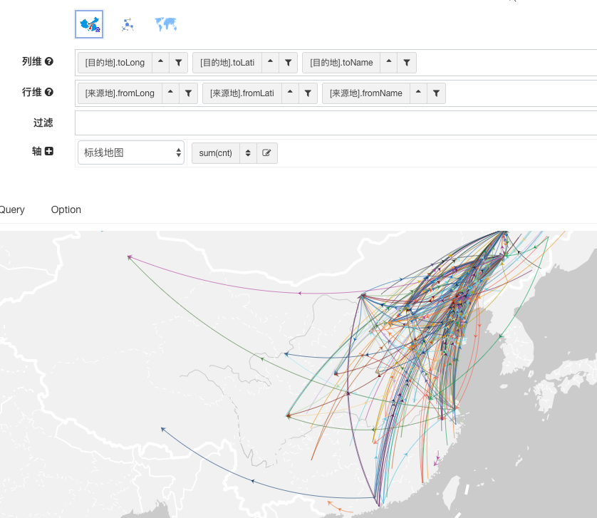

# 提问的正确姿势

!> 为打造良好的提问环境，节约所有成员时间，提问前请务必仔细度阅读文档；

!> 强烈推荐阅读 [《提问的智慧》](https://github.com/ryanhanwu/How-To-Ask-Questions-The-Smart-Way) 、 [《如何向开源社区提问题》](https://github.com/seajs/seajs/issues/545) [《如何有效地报告] Bug》](http://www.chiark.greenend.org.uk/%7Esgtatham/bugs-cn.html) 、 [《如何向开源项目提交无法解答的问题》](https://zhuanlan.zhihu.com/p/25795393) ，更好的问题更容易获得帮助。

## Github Issue
- GitHub Issue可用固化为知识库，支持搜索、可被Google检索
- 在访问Github网络通畅的情况下，首推在GitHub上面通过issue的形式问题交流
- 在提问之前搜索相关问题是否被问及过，进入issue页面，删除默认搜索条件<code>is:issue is:open </code>，输入查询关键词

- 确认需要新建issue，请严格按照issue模板填写相关问题描述，否则问题很可能将不会得到答复

<a href="https://github.com/yzhang921/CBoard/issues"><button type="button" class="btn btn-primary btn-sm">确认去提问</button></a>

## QQ交流群
?> 中国用户QQ交流群：301028618

!> 请大家将自己的群名片更改为**所在地+公司+部门+呢称**(如:上海-Xxx-BI-Peter)，否则问问题将得不到响应，还会被定期清退，感谢合作!
- 为打造良好的提问环境，节约所有成员时间，提问前请务必仔细度阅读文档，同一用户多次提问对于文档里面明显提及的问题，将会被踢出群。
- GitHub的Issue系统,可以检索历史问题，提问前也请检索一下是否有小伙伴遇到过同样的问题。
- 开始清理半年来从来不曾发言的僵尸用户，这次我们是认真的了。


# 常见问题
## 新建数据源保存失败
>**解决办法**： 查看CBoard源数据库连接配置是否正确，CBoard/src/main/resources/config.properties
```
validationQuery=SELECT 1
jdbc_url=jdbc:mysql://localhost:3306/cboard
jdbc_username=root
jdbc_password=111111
```

## 语言配置/切换语言

?> src\main\webapp\org\cboard\Settings.js

```javascript
var settings = {
    preferredLanguage: "en" // 可选值en/cn: cn切换中文
}
```


## Mysql保存中文元数据乱码问题
> 进入mysql 命令行, 查看mysql相关编码
```
mysql> show variables like 'character_set_%';
+--------------------------+---------------------------------------------------------+
| Variable_name | Value |
+--------------------------+---------------------------------------------------------+
| character_set_client | utf8 |
| character_set_connection | utf8 |
| character_set_database | utf8 |
| character_set_filesystem | binary |
| character_set_results | utf8 |
| character_set_server | utf8 |
| character_set_system | utf8 |
| character_sets_dir | C:\Program Files\MySQL\MySQL Server 5.7\share\charsets\ |
+--------------------------+---------------------------------------------------------+
8 rows in set (0.00 sec)
```

确保下面两项编码为utf-8
```
| character_set_database | utf8
| character_set_server | utf8
```
character_set_server 如果编码不对，有两种解决方案，

- 修改config.properties里面mysql的jdbc_url添加参数characterEncoding=utf-8
```
jdbc_url=jdbc:mysql://localhost:3306/cboard?characterEncoding=utf-8
```
如果你的数据源查询也出现了乱码, 或者本来有的数据加上中文条件之后查询不出来, 可以尝试通过同样的方式修复
- 参考这个网页，[重新设置mysql服务](http://www.2cto.com/database/201310/248493.html), 设置完成之后，重新cboard数据库
如果只有第一项数据库编码不对，可以先尝试drop掉DB之后重新创建
CREATE DATABASE cboard CHARACTER SET utf8;
- MAC用户修改my.cnf, 在[mysqld]之后添加一行 character-set-server = utf8 behind


## 几种地图说明
### **中国地图**
  最早引入的中国地图, 该地图需要的数据为带行政单位的省市县(区)维度, **如: 湖南省 -> 长沙市 -> 望城区**
  这个组件由CBoard最早的核心贡献者[Fine](https://github.com/Fine0830)使用D3开发, 后期由于贡献者本身工作太忙, 没有时间参与项目持续维护, 项目组自身对D3没有研究,
  其他的所有图形都是基于ECharts实现, 导致该地图发展到后来出现一系列问题, 最终不得已很早就在社区发通告决定下线[三级下钻中国地图](https://github.com/TuiQiao/CBoard/issues/322)
>- 看板导出失败，地图全黑 #216
- 下钻之后不能返回
- 以及其他一些小的其他问题

### **区域地图**
  用ECharts实现的可以限定区域的中国地图, 需要的数据为地理名称, 行政单位可带可不带, 用户可以在option栏里面根据自己的数据告诉程序是否带了行政单位即可

### **中国地图本地**
  严格来说这一个多种形式组合的地图组件, 需要的数据比较严格, 经度 + 维度 + 名称 (用户鼠标悬停显示), 考虑到数据格式稍复杂, 特意为该地图的需求加了帮助, 如下行维,列维右边的问号图表, 鼠标悬停会出来相应说明
  

### **中国地图(百度)**
  该地图调用百度在线地图, 数据要求和上面的中国地图本地一致, 需要联网请求百度地图API, 同时开发者贡献了一个自己的api账号, 这也导致有部分谨慎的开发者在内网环境部署的时候不能正常使用(phantomjs在服务端), 甚至防火墙检测到外网请求之后认为存在安全隐患

  !> 在这里希望用户在自己慎用的时候能改成自己的账号, 以免造成该账号请求过多被封号

  ```html
  <script src="http://api.map.baidu.com/api?v=2.0&ak=ZUONbpqGBsYGXNIYHicvbAbM"></script>
  ```

  


## 关于缓存
!> 首先声明缓存使用场景是: 查询慢, 但是返回数据量不大的数据集(对此我们也特意对离线数据集结果集大小做了合理限制), 对于数据源聚合的数据集, 默认你的数据源应该有比较强的计算能力, 故系统不会对数据源聚合的数据集做缓存
缓存从0.1到0.4经历了不同阶段的演进:
- 第一阶段: 最早引入jvm缓存是为了解决离线数据集太多之后, JVM压力过大引起内存溢出, 为此首先想到的是采用redis把数据移到外部分布式缓存;
- 第二阶段: 考虑到redis本身也不是所有小规模公司都会有现成的集群, 在加上redis对于大规模的读写性能也不是太好, 我们引入了ehchace可以混用JVM和文件系统做存储
- 第三阶段: 上述两个缓存策略都还只是解决了存储问题, 大家知道CBoard存储离线数据集之后是需要二次聚合操作的, 这就需要CBoard从redis/ehcahce里面把数据从JVM堆外读到堆内, 然后用最早的JvmAggregator做二次聚合操作.
  实践下来, 这个过程当中两次IO加上大量的JVM计算开销, 性能并不好; 如是就有了内嵌数据库h2, 该数据库可以把数据存在内存或者文件系统, 同时还可以做聚合操作, 相比如自己实现的聚合算法性能还非常好, 同样有帖子对此做跟踪解释
  [关于redis缓存](https://github.com/TuiQiao/CBoard/issues/276), 下面是config.properteis里面h2相关配置:
  ```properties
  # Storage File Syatem
  # 1 Stores data in file system
  aggregator.h2.url=jdbc:h2:~/H2Data/cboard;AUTO_SERVER=TRUE;LOG=0;UNDO_LOG=0
  # 2 Stores data outside of the VM's heap - useful for large memory DBs without incurring GC costs.
  #aggregator.h2.url=jdbc:h2:nioMemFS:cboard;LOG=0;UNDO_LOG=0
  aggregator.h2.database.name=cboard
  ```

!> 再次强烈建议大家遇到问题的时候多翻翻issue记录, 有问题在issue里面讨论, 形成知识库方便后续查询

## 关于明细数据展示
!> 所有产品都有自己的定位, 没有一种产品能够解决所有用户的需求;

一直以来CBoard的定位都是多维分析系统, 每次OLAP操作都是一次数据的聚合, 数据源数据量可以很大, 但是经过聚合之后往前端的数据必须小, 然后利用交叉表, 图表的形式直观的展示给分析师和决策者.
这也是BI, 多维分析的重要特征, 我们也希望用户能够更多的跳出传统表格数据的约束用合适的产品解决合适的数据分析问题.
当然这也导致很多想在CBoard上做明细表格展示的用户比较苦恼, 或是不理解; 希望使用者先是能够理解, 后期可能会对此类需求单独设计一套数据处理流程, 但是肯定不是在现有的数据流之上做.

## 数据集设置的时候维度的定制有什么用
目前维度定制只对Elasticsearch分桶配置有用, 其他类型的数据源可以无视

## 关于企业版
### 为什么要做商业版
随着时间推移, CBoard不知不觉已经开源快2年多时间, 从默默无闻到现在越来越多的用户开始接受, 并且在大大小小的众多公司得到了很好的实践与生产检验. 这个过程当中我们没有做过任何市场推广与宣传.

同时两年多时间我们培养了一大批用户, 包括之前从来没有接触过BI, OLAP, 多维分析概念的用户, 这让我们感到欣慰. 但是真正参与项目社区开发的人少之又少; 再加上从一开始这个项目就没有得到公司的支持, 只是社区上几个小伙伴利用工作之余的时间进行开发与维护(当中付出了无数工作日的夜晚与节假日).
这种状态下, 几个开发者本质工作稍微有些变动或是公司政策上稍有约束就不能继续参与到项目开发中来, 确实我们几个开发者都经历这种遭遇, 类似单点故障, 这样的结果当然是发起者和用户都最不愿意看到的.

在这个过程当中, 我们见过太多从一开始就想在社区产品之上独立二次开发包装成自己产品, 导致在社区版有重大更新的时候和项目脱节; 又或是用户投入了大量的人力物力, 结果开发思路就和产品本身不符合, 最终半途而废;
经过很长一段时间的挣扎, 我们决定依托于商业支持主导项目的发展.

### 企业版的定位
企业版后期的定位是在尽量提供通用分析能力的基础上, 做一个开放的BI产品开放平台, 允许用户和二次开发商能够自定定制UI与交互形式. 一方面兼容社区版的CBoard的元数据与操作流程, 另一方面在核心前后端SDK丰富的前提下用户可以基于之前社区版主要设计理念做自己的定制开发工作.
最重要的是保证性价比还要高, 让大家都能用得起;


