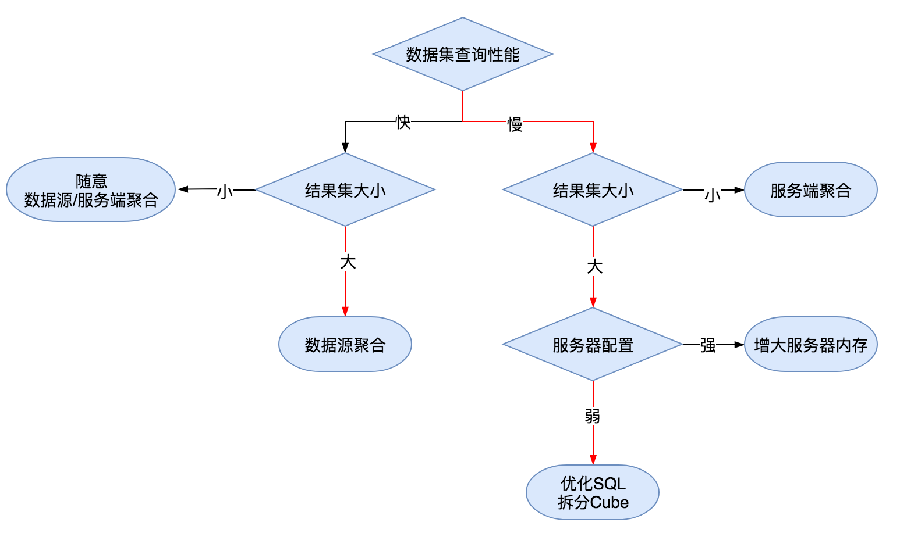

# 性能调优
---
## 聚合下推
<div class="bs-callout bs-callout-info" id="callout-focus-demo">
    <p>每一次OLAP操作都包含对定义数据集的再聚合操作！</p>
</div>

* 使用过`CBoard v0.2`或者更早版本的用户应该知道，之前CBoard**数据处理定位**为<mark>聚合结果集再聚合</mark>，二次聚合操作在客户端浏览器进行，大数据集聚合需要用户自己通过修改数据集聚合粒度聚合下推，这对于维度较多的数据集使用不太太方便。
* 0.3升级了的`DataProvider`，以及变更了数据流处理逻辑，一方面`离线数据集聚合`不再在前端做聚合方面操作，数据聚合只在服务端进行（下图左）；另一方面对于某些超大规模计算与存储数据源，可选聚合下推数据源进而完全释放CBoard本身计算压力（下图右）

<div class="t-alien-center">
    
</div>

### 离线数据集聚合下推服务端

* 聚合下推服务端对用户来说是透明的，CBoard使用JDK8 Stream + Lambda模拟数据库的聚合计算功能。聚合好之后的数据抛前端，浏览器只负责渲染图表
* 数据首次获取的时间由数据查询性能决定。请尽量优化自己的数据查询语句
* 尽可能的控制`数据集`与`查询`返回的数据量。我们压力测试下来，100W数据利用`SELECT * FROM TABLE`从后端传输到前端大概需要30s时间，浏览器使用100M左右内存，再聚合时间在5s以内，

!> 在非数据源聚合场景下，绝对不推荐这种用法，请尽量的控制后端返回数据在30W以内

* CBoard之前自带性能优化机制仍然有效
* 在没有建立**数据集**的前提下，相同的查询语句在同一看板页面只会加载一次
* 在事前定义了**数据集**的情况下，相同数据集查询后台一次，**自定义聚合表达式**和**维度数据过滤**都能够起到简化设计、减少查询的效果
* 查询缓存，一次数据加载会在服务器缓存12小时，避免第二次查询重复获取数据

### 聚合下推数据源
* 我们对JDBC、Kylin、ES DataProvider实现了聚合下推数据源的功能。其中ES、Kylin只能在数据源进行聚合, JDBC开启数据源聚合需要在建立数据源的时候勾选`数据源聚合`选项
* 通过用户前端拖拽操作的图表配置（Query Config）后端动态生成不同数据源产品的Query语句查询维度成员与最终聚合结果集
* 数据源聚合使用场景定位与高性能数据源，查询延时低，<mark>故此场景我们不会对查询查询结果进行任何缓存</mark>

### JDBC数据源下推原理

使用数据源聚合的JDBC连接，用户可以定义一个类似`SELECT * FROM foodmart.sales_fact`的查询，或者再复杂一些的查询，下图用户拖拽CUSTOM_ID和PRODUCT_ID，定义一个聚合算法count(TIME_ID)之后会,预览查看可以看到下面语句, 用户写的查询语句被当成一个子查询做了再一次聚合

```sql
SELECT CUSTOMER_ID, PRODUCT_ID ,COUNT(__view__.TIME_ID)
  FROM ( SELECT * FROM foodmart.sales_fact ) cb_view
 GROUP BY CUSTOMER_ID, PRODUCT_ID
```


---

## 整体优化路线图★



