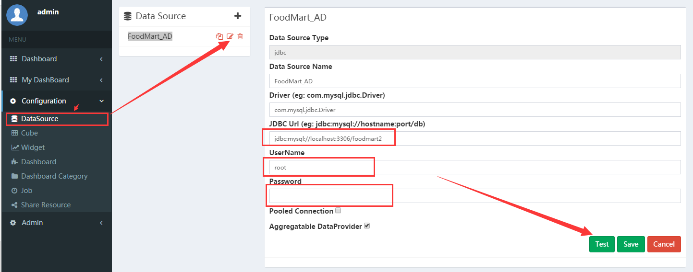

<h1> 快速开始 </h1>

## 从docker开始
我们为有Docker使用经验的朋友，在centos6之上构建了一个快速体验镜像，其中包含了一些演示数据集。
```bash
$ docker pull peterzhang921/cboard:0.4.1
$ docker run --rm -itd --name=cboard -p 8026:8080 --privileged=true peterzhang921/cboard:0.4.1

# after docker container is start then attach into it and start tomcat server
$ docker attach cboard
$ /opt/apache-tomcat/bin/startup.sh

# wait after server successfully started
$ tail -f /opt/apache-tomcat/logs/catalina.out
```

### 访问镜像中的CBoard 

<div class="bs-callout bs-callout-info">
    <h4>访问地址</h4>
    <p>http://docker-hostip:8026/cboard</p>
    <p>用户名: admin , 密码: root123</p>
</div>


### 自己重建镜像
镜像中的元数据使用嵌入式数据库H2存储, 存储介质为文件。 用户可以根据自己的需要改变配置，如：把H2数据库换成MySQL之类外部DB，<mark>配置变更之后需要重新构建镜像</mark> 
下面是镜像重建脚本，h2相关配置位于更目录的<code>h2</code>文件夹，用<code>-Denv=h2</code>指定编译打包只用的最终配置
```bash
# use configuration files in h2 folder, use env parameter then all the files in h2 folder will overwrite same files in resource folder
$ maven clean package -Denv=h2
# build docker image
$ docker build --network=host -t cboard .
```

## 自己编译构建项目

<div class="admonition warning">
  <p class="admonition-title"><i class="fa fa-exclamation-circle" aria-hidden="true"></i> 注意:</p>
  <p>为了避免由于JDK版本不匹配引起的各种问题强烈建议自行编译构建项目。</p>
</div>

### 项目要求

* JDK1.8 \(Java环境\)
* Maven3
* MySQL5+/SQLServer \(系统元数据存储\)
* Chrome \(客户端主流浏览器访问现在只支持Chrome\)
* 我们用的图表设计的拖拽现在测试下来只能支持chrome，我们是公司内部使用，对于兼容性没有太在意。由于我们没有专业前端开发，兼容性问题搞不定。拖拽使用的组件来自[angular-drag-and-drop-lists](https://github.com/marceljuenemann/angular-drag-and-drop-lists), 
希望有前端开发资源的朋友能够帮忙一起解决兼容性问题
* 并配置好maven仓库，这里推荐一个阿里云的maven镜像，速度还不错

```xml
<mirror>
  <id>alimaven</id>
  <name>aliyun maven</name>
  <url>http://maven.aliyun.com/nexus/content/groups/public/</url>
  <mirrorOf>central</mirrorOf>
</mirror>
```

* [PhantomJS](http://phantomjs.org/) Version 2.1+ \(用于看板导出与邮件发送\)
* 基础的数据库、数据仓库、OLAP数据分析知识或者Excel透视表使用经验
* 系统维护与管理者需要有一定的J2EE项目经验

### 获取代码
github上下载或者clone项目源代码
<div class="admonition danger">
  <p class="admonition-title"><i class="fa fa-exclamation-triangle" aria-hidden="true"></i> 警告</p>
  <p>CBoard仓库中以<code>branch-</code>开头的分支为开发分支，经过内部测试使用之后在分支上发布可用版本。<code>master</code>仅用来同步分支最新代码，非发布、不稳定分支，请不要在master进行项目构建。</p>
</div>

```bash
git clone https://github.com/yzhang921/CBoard.git
git checkout branch-0.4
```

### 准备CBoard元数据库

?> 以MySQL为例

#### 1. 从演示数据库开始
- 你可以从用于演示的样本数据库开始，包含样本元数据库(cboard_demo2)和样本DW库(foodmart2)
- 下载[cboard_demo & foodmart](https://pan.baidu.com/s/1GeS4-jAJl3nJBxLReU9wsQ), 密码:3x8i
- 终端命令行进入下载这两个脚本的目录，并解压foodmart.zip
- 进入MySQL命令行工具，执行下面两个脚本文件
```
mysql> source cboard_demo.sql
mysql> source foodmart.sql
```
- 成功执行之后检查 cboard_demo2 和 foodmart2 两个DB已经成功导入，最后查看一下数据

#### 2. 从空白元数据库开始
执行元数据创建脚本：
```mysql
$ cd cboard
mysql> create database cboard;
mysql> use cboard;
mysql> source sql/mysql/mysql.sql
```

### 修改配置文件

?> src/main/resources/config.properties

```pro
validationQuery=SELECT 1
jdbc_url=jdbc:mysql://localhost:3306/cboard # 修改指向第一步元数据库地址
jdbc_username=root # 修改数据库用户名连接密码
jdbc_password=111111

# Service configuration
dataprovider.resultLimit=300000
admin_user_id=1
phantomjs_path=D:/phantomjs-2.1.1-windows/bin/phantomjs.exe # 修改为服务器上的phantomjs位置，linux环境下确保有执行权限

# 邮件发送配置
mail.smtp.host=127.0.0.1
mail.smtp.port=8825
mail.smtp.from=test@test.com
#mail.smtp.username=test@test.com
#mail.smtp.password=111111
#mail.smtp.ssl.checkserveridentity=false

# Cache Properties 使用Redis做数据缓存的配置
cache.redis.hostName=127.0.0.1
cache.redis.port=6379
```

### 百度在线地图开发者 key

百度在线地图需要联网请求百度地图 API, 同时开发者贡献了一个自己的 api 账号, 这也导致有部分谨慎的开发者在内网环境部署的时候不能正常使用(phantomjs 在服务端), 甚至防火墙检测到外网请求之后认为存在安全隐患

!> 在产品上线之前请务必改成自己的账号, 以免造不必要的影响

[申请地址](http://lbsyun.baidu.com/apiconsole/key)

如果您不需要使用到在线地图，可以将下列文件中百度在线地图api请求注释掉
- src/main/webapp/starter.html
- src/main/webapp/render.html

```html
<!-- <script src="http://api.map.baidu.com/api?v=2.0&ak=ZUONbpqGBsYGXNIYHicvbAbM"></script> -->
```

### 编译构建

进入项目根目录(<code>pom.xml</code>所在目录)

<div class="admonition warning">
  <p class="admonition-title"><i class="fa fa-info-circle" aria-hidden="true"></i> 注意</p>
  由于我们再maven依赖中默认包含了SQLServer的JDBC驱动，但是该驱动在公有的Maven仓库中不存在，所以在不修改maven依赖的前提下构建项目需要本地安装一次SQLServer JDBC Driver；
  如果贵司使用环境中不涉及SQLServer数据库，可以选择把pom中下面依赖移除：
</div>

```xml
<dependency>
    <groupId>com.microsoft.sqlserver</groupId>
    <artifactId>sqljdbc4</artifactId>
    <version>4.0</version>
</dependency>
```

```bash
$ mvn install:install-file -Dfile=lib/sqljdbc4-4.0.jar -DgroupId=com.microsoft.sqlserver -DartifactId=sqljdbc4 -Dversion=4.0 -Dpackaging=jar
$ mvn clean package
```


### 部署war到tomcat容器

* 拷贝CBoard\target\cboard.war到tomcat的webapp目录
* 启动tomcat

### 访问应用

通过Chrome访问应用  
<b>http://_yourserverip_:8080</b>  
默认登录用户名和密码: admin/root123

### 样本数据源是否配置正确
<div class="admonition warning">
  <p class="admonition-title"><i class="fa fa-info-circle" aria-hidden="true"></i> 注意</p>
  为了数据安全，在编辑数据源的时候，密码不会被加载回前端。故每次测试数据连接和修改数据连接的时候请再次输入连接密码。
</div>



## CBoard使用基本步骤


